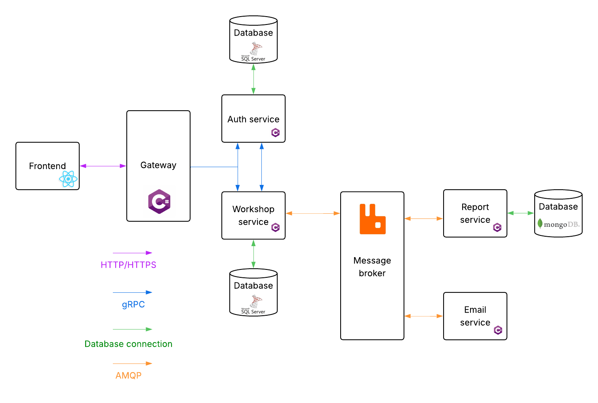

# 🚗 Car service 🚗

## 🧑‍🔧 Authors
- **Michalczak Antoni**
- **Nabagło Dawid**

## 📜 Description
Web application designed specifically for car service management.

### ⭐ Features
- **Customer and vehicle management**
- **Service orders** with tasks and parts
- **Task assignment** to mechanics
- **Order commenting**
- **PDF report generation**
- **Vehicle photo uploads**
- **Repair filtering and reporting**

### 📝 Application Architecture Diagram

### 🧩 System Components

| Component         | Technology         | Functionality |
|------------------|--------------------|---------------|
| **Frontend**      | Next.js (React, TypeScript) | - Multi-page web application - Built with React and TypeScript |
| **Gateway**       | C#                 | - Entry point for the application - Defines and handles all routes |
| **Auth Service**  | C#                 | - Manages user credentials - Token generation and validation - Handles authentication |
| **Workshop Service** | C#              | - Manages workers - Provides all core workshop-related features |
| **Auth Database** | MSSQL              | - Stores user data - Manages roles and permissions |
| **Main Database** | MSSQL              | - Stores workshop-related data - Includes vehicles, repairs, parts, etc. |
| **Message Broker** | RabbitMQ          | - Queueing and processing report generation requests - Receiving and distributing report status updates - Triggering email notifications once reports are generated - Ensures reliability and scalability by decoupling processes |
| **Report Service**| C#                 | - Manages and generates reports |
| **Email Service** | C#                 | - Sends emails (e.g., notifications after report generation) |
